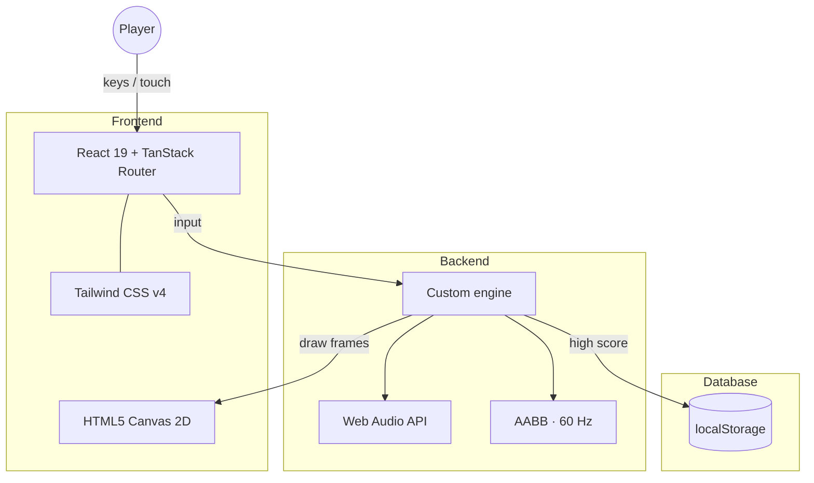

<p align="center">
  
</p>

<h1 align="center">越南大戰 · Vietnam Strike</h1>

<p align="center">
  <strong>Operation Jungle · 1968</strong><br>
  橫向 2D 捲軸動作射擊　·　Side-scrolling run-and-gun
</p>

<p align="center">
  <a href="#遊戲特色--features"></a>
  
  
  
  <a href="LICENSE"></a>
</p>

<p align="center">
  
  &nbsp;
  
  &nbsp;
  
  &nbsp;
  
  &nbsp;
  
  &nbsp;
  
  &nbsp;
  
</p>

---

深入叢林，清出防線，在前線擊墜武裝直升機。  
A jungle raid in the spirit of classic *Contra* and *Metal Slug*: eight-way fire, coyote jump, grenades, weapon pickups, and a final gunship.

<p align="center">
  
  &nbsp;
  
</p>

---

## 遊戲特色 / Features

| | |
| :--- | :--- |
| **多層視差叢林** | Four-layer parallax sky, canopy, mist, and ground that scroll at independent rates. |
| **八方向射擊** | Aim up, down, and while jumping. Hold fire for full-auto. |
| **街機手感** | Coyote time, jump buffer, variable jump height, crouch. |
| **武器與補給** | Rifle, machine gun, spread shot, grenades, medkits. |
| **多樣敵人** | Infantry, sandbag gunners, helicopters, tanks, and a boss gunship. |
| **鍵盤 + 觸控** | Desktop keys plus on-screen stick, fire, jump, and grenade on mobile. |
| **即時音效** | Web Audio synthesis — no audio files to download. |
| **最高戰績** | High score saved locally in the browser. |

---

## 作戰區域 / The Operation

A single 10,800 px raid, split into three named sectors:

```text
  叢林小徑 ──────── 河岸村落 ──────── 前線指揮
  Jungle Path         River Village      Forward HQ
       │                   │                  │
    infantry            gunners            lock-in
    first heli          tanks              BOSS gunship
```

| Sector | What you face |
|--------|----------------|
| **叢林小徑** | Opening infantry, platforms, the first helicopter. |
| **河岸村落** | Huts, sandbag gunners, tanks, overlapping air support. |
| **前線指揮** | Camera lock. Survive the armed helicopter until it goes down. |

Checkpoints keep you in-sector after a death. Three lives. Fall in a pit and the raid is over for that life.

---

## 武裝 / Arsenal

| Pickup | Name | Role |
|--------|------|------|
| Rifle | **步槍** | Default. Reliable single shots. |
| MG | **機槍** | Faster cadence, slight spread. |
| Spread | **散彈** | Five pellets. Close-range wipe. |
| 彈 | **手榴彈** | Arc, bounce, blast. Limited stock. |
| Medkit | **急救包** | Restore HP in the field. |

---

## 操作方式 / Controls

### Keyboard

| Key | Action |
|-----|--------|
| <kbd>A</kbd> <kbd>D</kbd> or <kbd>←</kbd> <kbd>→</kbd> | Move |
| <kbd>W</kbd> | Aim up |
| <kbd>S</kbd> | Crouch · aim down in air |
| <kbd>Space</kbd> or <kbd>K</kbd> | Jump |
| <kbd>J</kbd> or <kbd>Z</kbd> | Fire (hold for auto) |
| <kbd>L</kbd> or <kbd>G</kbd> | Grenade |
| <kbd>Esc</kbd> | Pause |
| <kbd>M</kbd> | Mute |

### Mobile

Virtual stick in the lower left. **射 / 跳 / 彈** on the right. Tilt the stick up to aim high, down to crouch.

---

## 開始遊戲 / Getting Started

Requires **Node.js 22+**.

```bash
npm install
npm run dev
```

Then open [http://localhost:8080](http://localhost:8080).

```bash
npm run build      # production bundle
npm run preview    # serve the built app
npm run typecheck  # TypeScript
```

No account, no backend. High score lives in `localStorage`.

---

## 技術架構 / Tech Stack

| Layer | Choice |
|-------|--------|
| UI shell | React 19 + TanStack Router |
| Bundler | Vite |
| Language | TypeScript |
| Rendering | HTML5 Canvas 2D |
| Styling | Tailwind CSS v4 |
| Audio | Web Audio API (synthesized SFX) |
| Physics | Custom AABB, 60 Hz fixed timestep |



Game logic lives in `src/game/` — engine, input, audio, level layout, and sprite loading. The canvas is 1280×720, letterboxed to the window.

---

## 專案結構 / Layout

```text
├── src/game/            engine, input, audio, level, canvas app
├── src/routes/          pages
├── public/game/         runtime sprites & parallax maps
├── assets/              source animation frames
├── docs/                README screenshots & sprite GIFs
├── banner.jpg           GitHub hero art
└── LICENSE
```

---

## License

[MIT](LICENSE) for the code.

This is a **fan-made arcade tribute** for learning and demonstration. It is not affiliated with SNK, Nazca, Konami, or any historical documentary. Artwork is original-generated; confirm licenses yourself before any commercial use.

---

<p align="center">
  
</p>
<p align="center">
  <sub>Operation Jungle · 1968</sub><br>
  <sub>Made for fun · Play in the jungle</sub>
</p>
